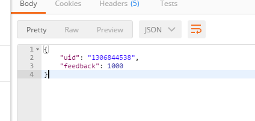
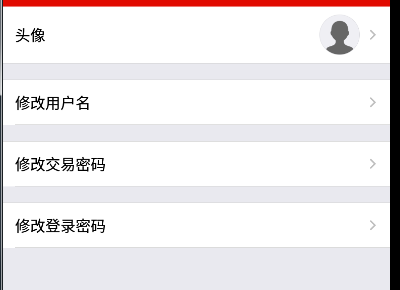
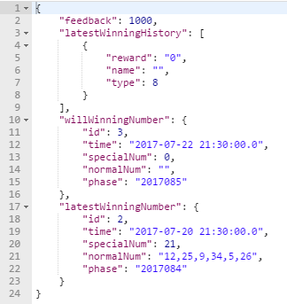
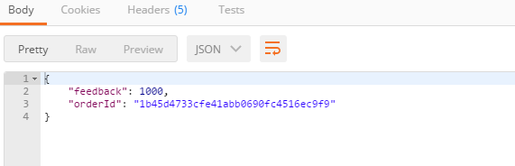
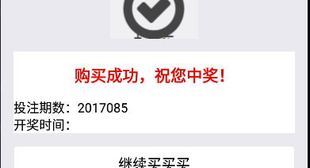
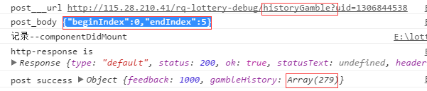
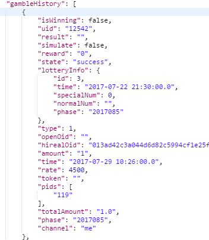
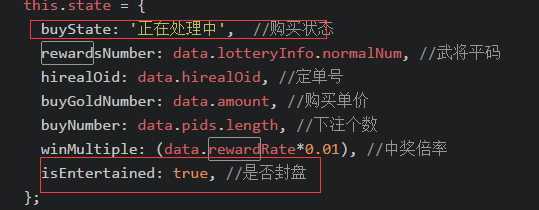
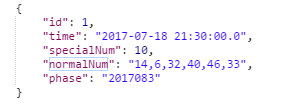
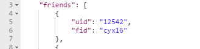

# 需求--NOTE
## 列表
1. [登录和注册](### 登录和注册[手机验证码])

2. [主页](### 主页)
  1. [主页内容](#### 1. 主页内容)
  1. [跑马灯](#### 2. 跑马灯)
  1. [下注](#### 3.  下注)
  1. [购买](#### 4. 购买)
3. [记录](### 记录)
  1. [购买记录](#### 1. 购买记录)
  1. [开奖记录](#### 2. 开奖记录)
4. [好友](### 好友)
5. [个人中心](### 个人中心)

### 登录和注册[手机验证码]
- reponseBody-data 

- needData 

### 主页
#### 1. 主页内容
- responseBody-data 

- needData 
latestWinningHistory补齐
#### 2. 跑马灯
- 尚缺少。
#### 3.  下注
- responseBody-data 

- needData 
需不需要加以下数据。一切以后台为准 

#### 4. 购买
- responseBody-data 

- needData 
开奖时间 

### 记录

#### 1. 购买记录
**1. responseOne(数据内容)**

- responseBody-data 
请求bug 
 
数据 

- needData 

**2. responseTwo(取消关注)**
- 尚缺少

#### 2. 开奖记录
- responseBody-data 

- needData 
 暂无

### 好友
- responseBody-data 
 
- needData 

### 个人中心
- 尚无(上传（需fromData）) 

- 尚无（支付二维码列表） 

